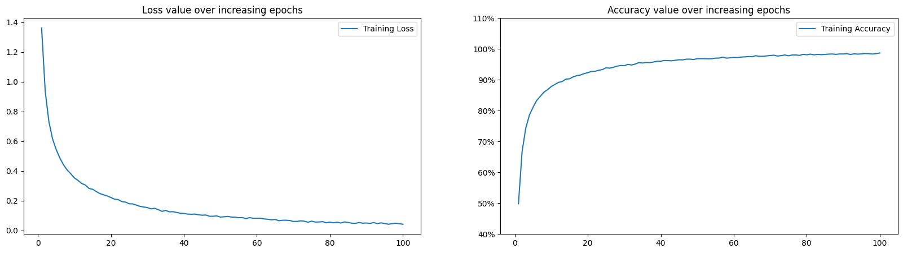
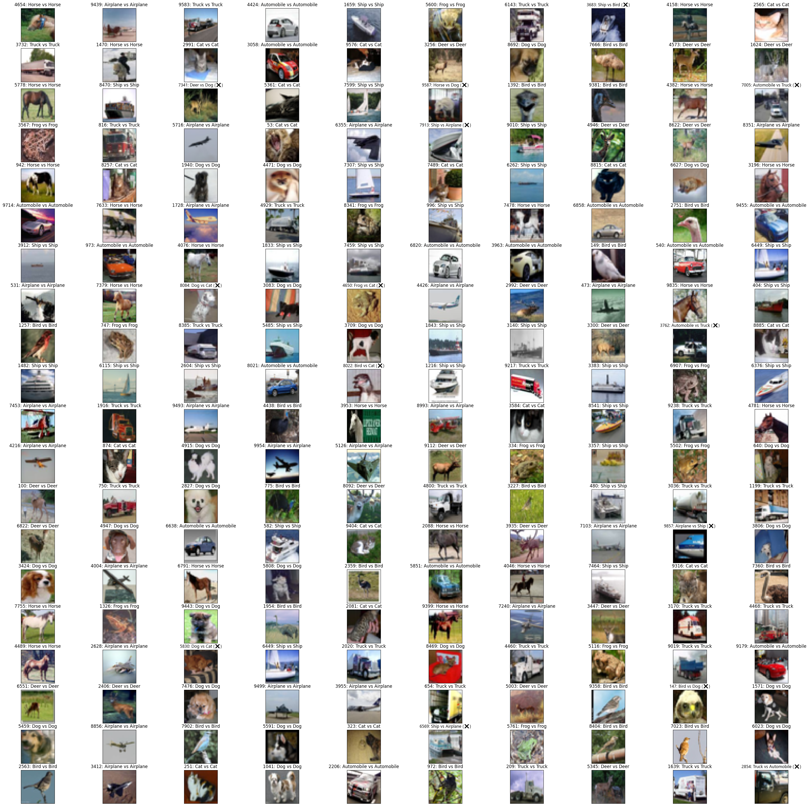

# ***ResNet***

Codes for ResNet 18/34/50/101/152 for classification and code for running ResNet28 on CIFAR-10 dataset.

## **Overview**

This model is based on *Deep Residual Learning for Image Recognition* by Kaiming He et al. (2015).
Residual connection has expanded beyond ResNet model, and has become extremely influential, as seen in many other models since it helps resolve the vanishing gradients very well and does not cost much computation.
The code for ResNet 18/34/50/101/152 was adjusted mainly on the maxpool since I replace it with stride = 2. 
ResNet 28 is a shorted version of ResNet34 with only 3 stages.

## **Model details**

**Features**

1. **Residual connections** for stable gradient flow and deeper architectures
2. **Configurable depth** via `block_list` (number of residual blocks per stage)
3. **Adaptive Average Pooling** + fully-connected classification head
4. **Lightweight** design with much fewer parameters than standard ResNet-18/34

**Dataset**
- Evaluated on **CIFAR-10** (32×32 natural images, 10 classes)

**Augmentation**
- Random horizontal flip
- Random crop with padding
- Normalization with CIFAR-10 mean/std

## **Training**

**Setup**
- Python: **3.11**
- PyTorch: **2.5.1+cu121**
- GPU: **RTX 4070 Super**

**Hyperparameters**
- Epochs: **100**
- Learning rate: **0.001**
- Optimizer: **SGD** with momentum 0.9
- Scheduler: **LinearLR** with (start_factor = 0.1, end_factor = 1, total_iters = 60)

**Result** of ***Image Classification***
- Top-1 Accuracy = 98.7 % (CIFAR-10)
- Parameters ≈ 5.845M
- GFLOPs ≈ 1.68
=> Quite expensive to train, not yet optimized and lightweight

**Visualization**
*Metrics plotting*

    
  <em> Training loss and accuracy curves </em>

*Classified outputs on CIFAR-10*

    
  <em> Training loss and accuracy curves </em>

## **References**

* ResNet paper: https://arxiv.org/abs/1512.03385

